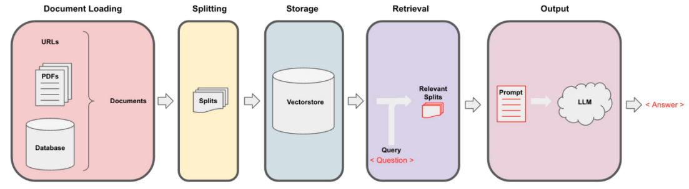
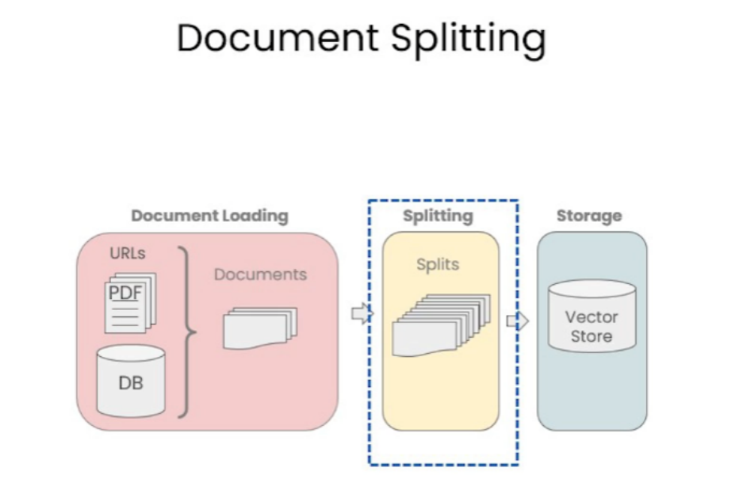
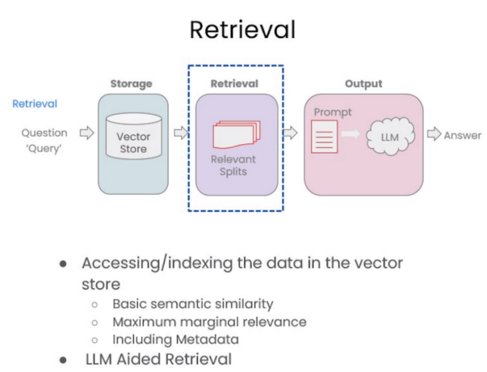
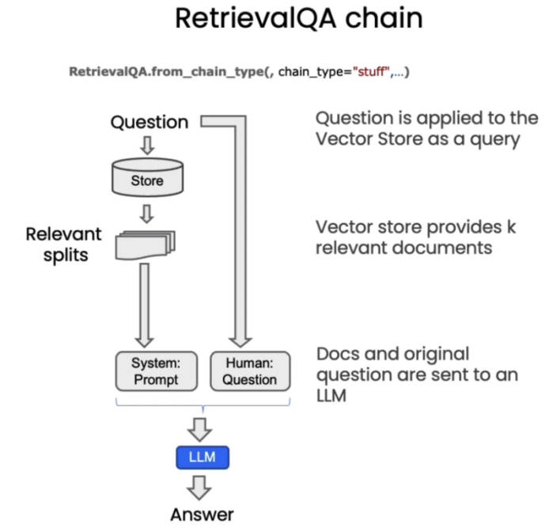
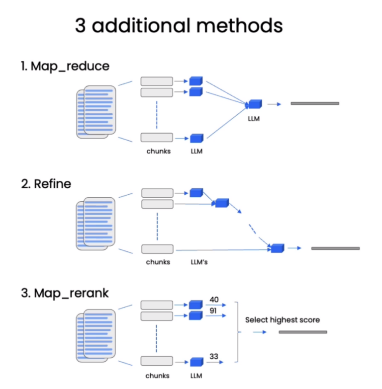

# 基于本地知识库的医疗领域大模型问答



# 文档加载

1. 使用 `PyMuPDFLoader` 来读取知识库的 PDF 文件。`PyMuPDFLoader` 是 PDF 解析器中速度最快的一种，结果会包含 PDF 及其页面的详细元数据，并且每页返回一个文档。

2. 使用`TextLoader`读取txt文本文件。

# 文本分割

如何进行文本分割，往往与我们的任务类型息息相关。当我们拆分代码时，这种相关性变得尤为突出。因此，我们引入了一个语言文本分割器，其中包含各种为 Python、Ruby、C 等不同编程语言设计的分隔符。在对这些文档进行分割时，必须充分考虑各种编程语言之间的差异。



我们将进行字符的分割，借助 `LangChain` 提供的 `RecursiveCharacterTextSplitter` 和 `CharacterTextSplitter` 工具来实现此目标。

`CharacterTextSplitter` 是字符文本分割，分隔符的参数是单个的字符串；`RecursiveCharacterTextSplitter` 是递归字符文本分割，将按不同的字符递归地分割（按照这个优先级["\n\n", "\n", " ", ""]），这样就能尽量把所有和语义相关的内容尽可能长时间地保留在同一位置。因此，`RecursiveCharacterTextSplitter` 比 `CharacterTextSplitter` 对文档切割得更加碎片化。

# 文档词向量化与持久化

在机器学习和自然语言处理（NLP）中，Embeddings（嵌入）是一种将类别数据，如单词、句子或者整个文档，转化为实数向量的技术。这些实数向量可以被计算机更好地理解和处理。嵌入背后的主要想法是，相似或相关的对象在嵌入空间中的距离应该很近。

在词嵌入中，每个单词被转换为一个向量，这个向量捕获了这个单词的语义信息。例如，"king" 和 "queen" 这两个单词在嵌入空间中的位置将会非常接近，因为它们的含义相似。而 "apple" 和 "orange" 也会很接近，因为它们都是水果。而 "king" 和 "apple" 这两个单词在嵌入空间中的距离就会比较远，因为它们的含义不同。

之后，我们使用`Chroma`将数据持久化至磁盘上。（轻量级且数据存储在内存中，这使得它非常容易启动和开始使用。）

# 进行检索式问答

在构建检索增强生成 (RAG) 系统时，信息检索是核心环节。检索模块负责对用户查询进行分析，从知识库中快速定位相关文档或段落，为后续的语言生成提供信息支持。

**检索是指根据用户的问题去向量数据库中搜索与问题相关的文档内容。**在问答系统中，可以使用基本语义相似度来评估用户问题与候选答案之间的相似性。通过计算它们的语义向量相似度，可以找到与问题最相关的答案。而在文本排序方面，可以使用最大边际相关性来对候选答案进行排序，以确保相关性和多样性的平衡。



- **基本语义相似度（Basic Semantic Similarity）**是一种计算文本之间相似性的方法。它通常基于词向量模型（如Word2Vec、GloVe等）或预训练的语言模型（如BERT、ELMo等）来表示文本的语义信息。通过计算文本之间的向量相似度，可以衡量它们在语义上的接近程度。常见的计算相似度的方法包括余弦相似度、欧氏距离等。

- **最大边际相关性（Maximum Marginal Relevance，MMR**）是一种用于文本排序的方法。它主要用于信息检索和摘要生成等任务中。MMR方法通过综合考虑文本的相关性和多样性来进行排序。具体而言，它使用一个相关性评分来度量文本与查询的相关程度，并结合一个多样性评分来确保结果的多样性。MMR方法通过最大化相关性和最大化与已选择文本的差异性之间的边际，来选择最佳的文本。

# 构造检索式问答链

基于 `LangChain`，我们可以构造一个使用千帆大模型进行问答的检索式问答链，这是一种通过检索步骤进行问答的方法。我们可以通过传入一个语言模型和一个向量数据库来创建它作为检索器。然后，我们可以用问题作为查询调用它，得到一个答案。



在获取与问题相关的文档后，我们需要将文档和原始问题一起输入语言模型，生成回答。默认是合并所有文档，一次性输入模型。但存在上下文长度限制的问题，若相关文档量大，难以一次将全部输入模型。针对这一问题，存在`MapReduce` 、`Refine` 和 `MapRerank` 三种策略。



- MapReduce 通过多轮检索与问答实现长文档处理
- Refine 让模型主动请求信息
- MapRerank 则通过问答质量调整文档顺序。

# 附录

## 类别词汇对应表

|   类别   |    词汇    |
| :------: | :--------: |
|  妇产科  |   woman    |
|   眼科   |    eye     |
|  心内科  | cardiology |
|  药理学  |  medicine  |
| 常见疾病 |  disease   |
|   癌症   |   cancer   |
| 医疗器械 |   device   |

## 数据来源

```text
药理学
https://zhuanlan.zhihu.com/p/164961617
https://zhuanlan.zhihu.com/p/165216521
医疗器械
http://www.nxgy.gov.cn/zwgk/zfxxgkml/spyp/spypjg3/201708/t20170808_386803.html
http://www.nxgy.gov.cn/zwgk/zfxxgkml/spyp/spypjg3/201708/t20170808_386804.html
心内科
https://www.sohu.com/a/342578283_456057
癌症
https://wjw.hunan.gov.cn/wjw/ztzl/knowledge/zthd/jljh/201605/t20160530_4044693.html
http://www.caca.org.cn/system/2021/04/30/030005405.shtml
https://www.cancer.org/content/dam/cancer-org/cancer-control/zh/booklets-flyers/what-is-cancer.pdf
https://blog.dana-farber.org/insight/zh-hans/%E7%99%8C%E7%97%87%E5%92%8C%E8%82%BF%E7%98%A4%E7%9A%84%E5%8C%BA%E5%88%AB/
眼科
http://cnszgx.cn/read.asp?ID=86
https://zhuanlan.zhihu.com/p/359339233
https://www.sohu.com/a/654565938_120960539
https://www.sohu.com/a/415154851_487694
妇产科
https://www.medsci.cn/article/show_article.do?id=5fbb11600e0a
https://zhuanlan.zhihu.com/p/267976684
http://wsjkw.jl.gov.cn/zdzt/jkkp/202108/t20210805_8170018.html
疾病
https://hospital.nwu.edu.cn/info/1036/2087.htm
http://www.ynlf.gov.cn/info/3132/68031.htm
https://www.kepuchina.cn/qykj/yxqy/201712/t20171208_291650.shtml
http://jk.anhuinews.com/newjklm/jkdjt/202310/t20231003_7104539.html
中医体质
http://www.sdgwlc.com/health_detail/879.html
https://finance.sina.cn/2021-07-27/detail-ikqciyzk7865390.d.html
```

